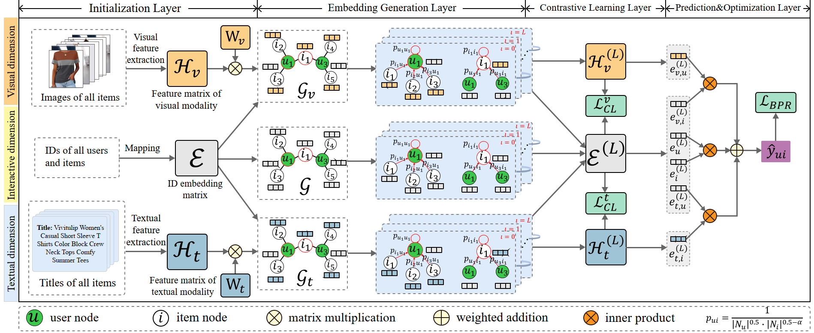

    

    
    
    
    

Many state-of-the-art multimedia recommender efforts effectively alleviate the issues of sparsity and cold-start via modeling multimodal user preference. The core paradigm of them is based on graph learning techniques, which perform high-order message propagation of multimodal information on  user-item interaction graph, so as to obtain the node representations that contain both interactive- and multimodal-dimension user preferences. However, we argue that such a paradigm is suboptimal because it ignores two problems, including (1) the presence of a large number of preference-independent noisy data in the items' multimodal content, and (2) the propagation of this multimodal noise over the interaction graph contaminates the representations of both interactive- and multimodal-dimension user preferences.

In this work, we aim to reduce the negative effects of multimodal noise and further improve user preference modeling. Towards this end, we develop a multimodal graph contrastive learning (MGCL) approach, which decomposes user preferences into multiple dimensions and performs cross-dimension mutual information maximization, so that user preference modeling over different dimensions can be enhanced with each other. In particular, we first adopt the graph learning approach to generate representations of users and items in the interaction and multimodal dimensions, respectively. Then, we construct an additional contrastive learning task to maximize the consistency between different dimensions. Extensive experiments on three public datasets validate the effectiveness and scalability of the proposed MGCL.

We provide tensorflow implementation for MEGCF. 

### Before running the codes, please download the [datasets](https://www.aliyundrive.com/s/cmEeDMecU88) and copy them to the Data directory.

## prerequisites

- Tensorflow 1.10.0
- Python 3.5
- NVIDIA GPU + CUDA + CuDNN
